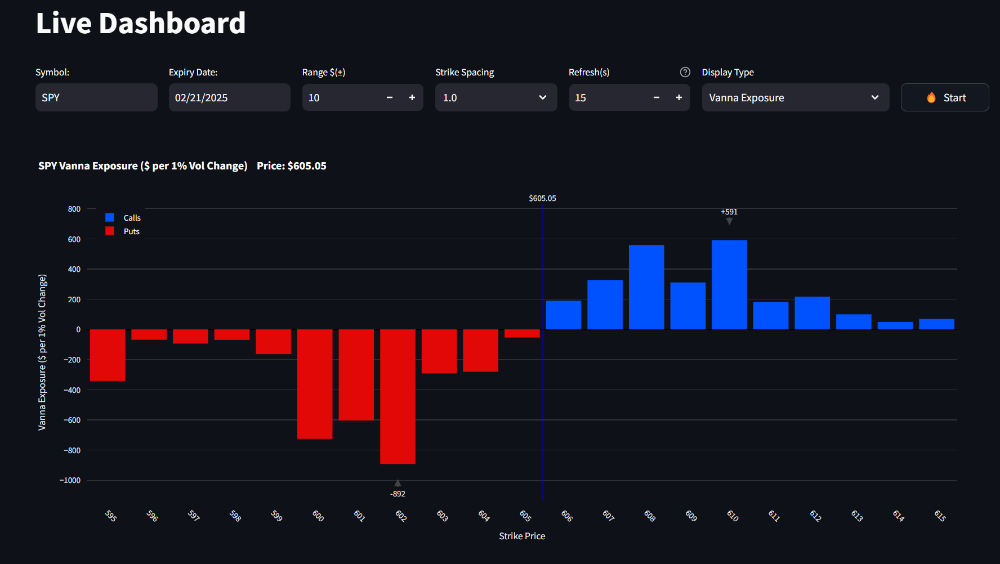

# TOS Streamlit Dashboard w Vanna Exposure

A real-time dashboard using ThinkorSwim's RTD (Real-Time Data) and Streamlit.

## Vanna



## Prerequisites

- Windows OS (required for ThinkorSwim RTD)
- Python 3.11+
- ThinkorSwim desktop application installed and running

## Installation

1. Clone the repository
```bash
git clone https://github.com/2187Nick/tos-streamlit-dashboard
cd tos-streamlit-dashboard
```
2. Switch to the vanna branch
```bash
git checkout vanna
```

3. Set up Python environment
```bash
python -m venv venv
.\venv\Scripts\activate
pip install -r requirements.txt
```

## Usage

1. Start ThinkorSwim desktop application and log in
2. Run the dashboard:
```bash
streamlit run app.py
```
3. Open the browser and navigate to `http://localhost:8501`

## Interface Controls


- **Symbol**: Ticker symbol (e.g., "SPY")
- **Expiry Date**:  Contract expiration date (Defaults to the nearest Friday)
- **Strike Range**: Range of strikes to monitor (Defaults to +- $10)
- **Strike Spacing**: Spacing between strikes (Defaults to 1)
- **Refresh Rate**: Data refresh rate (Defaults to 15 seconds)
- **Start/Stop**: Toggle data streaming

## Notes

- This does work with Ondemand. Can use this on weekends to review historical data.
- Vanna values are displayed in millions of dollars per 1% move in Implied Volatility.

## Credit
Backend:

[@FollowerOfFlow](https://x.com/FollowerOfFlow) worked some magic to get TOS RTD working directly with Python.

Check it out here: [pyrtdc](https://github.com/tifoji/pyrtdc/)

Vanna Exposure Calculations:  [medium article](https://medium.com/option-screener/so-youve-heard-about-gamma-exposure-gex-but-what-about-vanna-and-charm-exposures-47ed9109d26a)

## Support
[@2187Nick](https://x.com/2187Nick)

[Discord](https://discord.com/invite/vxKepZ6XNC)

## Naive Dealer Vanna Exposure. (Need to confirm this is correct):
Formula:
call vanna exposure = call_oi * call_vanna * 100 * spot * implied volatility
put vanna exposure = put_oi * put_vanna * 100 * spot * implied volatility

Vanna Exposure = call vanna exposure + put vanna exposure

For calls (dealer long):

OTM calls: Positive vanna → higher vol increases delta → dealer must sell more stock

ITM calls: Negative vanna → higher vol decreases delta → dealer must buy back stock

For puts (dealer short):

OTM puts: Negative vanna → higher vol makes put delta more negative → dealer must sell more stock

ITM puts: Positive vanna → higher vol makes put delta less negative → dealer must buy back stock

Similar to our delta exposure formula, we use negative signs because:

When dealer is long calls, must hedge by shorting stock
When dealer is short puts, must hedge by shorting stock

This formula gives us the dollar value of stock the dealer needs to buy (positive) or sell (negative) when volatility changes, to maintain delta neutrality.

## Issues to address:
- [ ] IV retrieves "NAN" the further out of the money we go. Calculate IV in that scenario?
- [ ] Days to expiration is correct? What time do options officially expire?
- [ ] Add Implied Volatility Slider. This will allow us to see how Vanna changes with different IV levels.

<br />
<div align="center">
  <p>Finding value in my work?</p>
  <a href="https://www.buymeacoffee.com/2187Nick" target="_blank"></a>
</div>