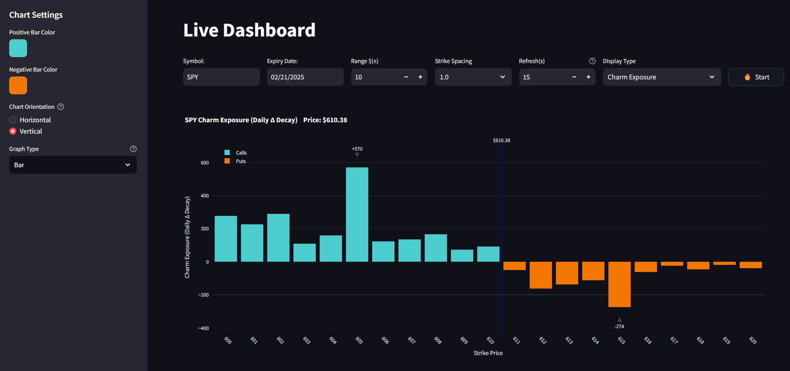

# TOS Streamlit Dashboard w Charm Exposure

A real-time dashboard using ThinkorSwim's RTD (Real-Time Data) and Streamlit.

## Charm



## Prerequisites

- Windows OS (required for ThinkorSwim RTD)
- Python 3.11+
- ThinkorSwim desktop application installed and running

## Installation

1. Clone the repository
```bash
git clone https://github.com/2187Nick/tos-streamlit-dashboard
```
2. Install dependencies:
```bash
pip install -r requirements.txt
```

## Usage

1. Start ThinkorSwim desktop application and log in
2. Run the dashboard:
```bash
streamlit run app.py
```
3. Open the browser and navigate to `http://localhost:8501`

## Interface Controls


- **Symbol**: Ticker symbol (e.g., "SPY")
- **Expiry Date**:  Contract expiration date (Defaults to the nearest Friday)
- **Strike Range**: Range of strikes to monitor (Defaults to +- $10)
- **Strike Spacing**: Spacing between strikes (Defaults to 1)
- **Refresh Rate**: Data refresh rate (Defaults to 15 seconds)
- **Start/Stop**: Toggle data streaming

## Notes

- This does work with Ondemand. Can use this on weekends to review historical data.
- Gamma values are displayed in millions of dollars per 1% move in underlying asset

## Credit
Backend:

[@FollowerOfFlow](https://x.com/FollowerOfFlow) worked some magic to get TOS RTD working directly with Python.

Check it out here: [pyrtdc](https://github.com/tifoji/pyrtdc/)

Charm Exposure Calculations:  [medium article](https://medium.com/option-screener/so-youve-heard-about-gamma-exposure-gex-but-what-about-vanna-and-charm-exposures-47ed9109d26a)

## Support
[@2187Nick](https://x.com/2187Nick)

[Discord](https://discord.com/invite/vxKepZ6XNC)

## Naive Dealer Charm Exposure. (Need to confirm this is correct):
Formula: (call OI + put OI) × charm × 100 × underlying_price

For calls (dealer long):

OTM calls: Positive charm → dealer buys stock
ITM calls: Negative charm → dealer buys stock


For puts (dealer short):

OTM puts: Positive charm → dealer buys stock
ITM puts: Negative charm → dealer buys stock

The dealer's position (long calls, short puts) combined with the charm effect means
all components work in the same direction, so we ADD the open interest.

This formula will give us the dollar value of stock the dealer needs to buy (positive)
or sell (negative) due to the passage of one day.

## Issues to address:
- [ ] IV retrieves "NAN" the further out of the money we go. Calculate IV in that scenario?
- [ ] Days to expiration is correct? What time do options officially expire?
- [ ] Add Charm Exposure per hour?

<br />
<div align="center">
  <p>Finding value in my work?</p>
  <a href="https://www.buymeacoffee.com/2187Nick" target="_blank"></a>
</div>