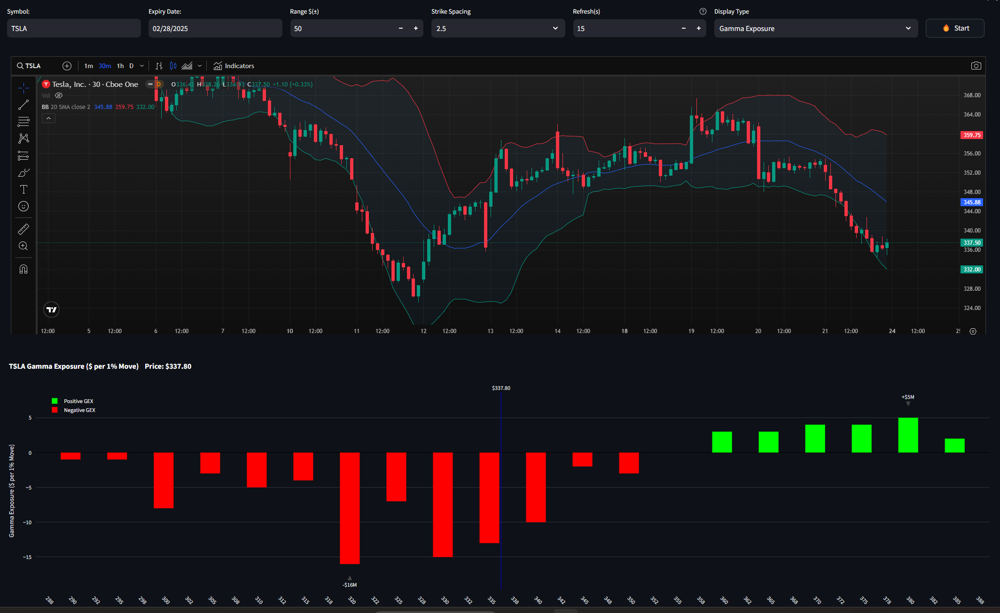

# TOS Streamlit Dashboard w TradingView Chart

A real-time dashboard using ThinkorSwim's RTD (Real-Time Data) and Streamlit.

## Vanna



## Prerequisites

- Windows OS (required for ThinkorSwim RTD)
- Python 3.11+
- ThinkorSwim desktop application installed and running

## Installation

1. Clone the repository
```bash
git clone https://github.com/2187Nick/tos-streamlit-dashboard
cd tos-streamlit-dashboard
```
2. Switch to the tradingview branch
```bash
git checkout tradingview
```

3. Set up Python environment
```bash
python -m venv venv
.\venv\Scripts\activate
pip install -r requirements.txt
```

## Usage

1. Start ThinkorSwim desktop application and log in
2. Run the dashboard:
```bash
streamlit run app.py
```
3. Open the browser and navigate to `http://localhost:8501`

## Interface Controls


- **Symbol**: Ticker symbol (e.g., "SPY")
- **Expiry Date**:  Contract expiration date (Defaults to the nearest Friday)
- **Strike Range**: Range of strikes to monitor (Defaults to +- $10)
- **Strike Spacing**: Spacing between strikes (Defaults to 1)
- **Refresh Rate**: Data refresh rate (Defaults to 15 seconds)
- **Start/Stop**: Toggle data streaming

## Notes

- This does work with Ondemand. Can use this on weekends to review historical data.

## Credit
Backend:

[@FollowerOfFlow](https://x.com/FollowerOfFlow) worked some magic to get TOS RTD working directly with Python.

Check it out here: [pyrtdc](https://github.com/tifoji/pyrtdc/)

## Support
[@2187Nick](https://x.com/2187Nick)

[Discord](https://discord.com/invite/vxKepZ6XNC)

## Issues to address:
- [ ] Can we display RTD data in tradingview chart?

<br />
<div align="center">
  <p>Finding value in my work?</p>
  <a href="https://www.buymeacoffee.com/2187Nick" target="_blank"></a>
</div>